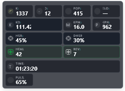
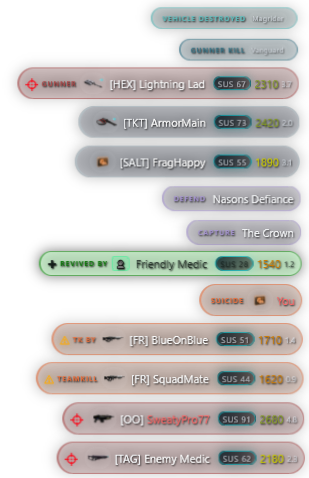

# Auraxify Overlay Neutral

**Auraxify Overlay Neutral** is a compact, faction-neutral overlay theme for **Auraxify** in **PlanetSide 2**.

It is designed to show useful combat, support, and session information without covering the game or pulling attention away from the fight.

Created by **AzzArr**.

## Preview

### Status Panel



### Killfeed



## Features

- Clean neutral style for players who play across VS, NC, TR, and NSO.
- Compact status panel with grouped stats and small readable cards.
- Stat cards use title on top, value below, and icons where useful.
- Support-friendly stats such as heal and revive without making the theme medic-only.
- Combat stats such as kill, death, KD, HSR, KPM, KPH, knife, C4, and more.
- Smart stat grouping: paired stats can expand when the other item is hidden in Auraxify.
- Compact killfeed with event-family colors for faster scanning.
- Killfeed color customization through CSS variables.
- Included local killfeed color preview tool in `dev/killfeed-preview.html`.
- CSS-only contributor easter eggs for selected character IDs.
- No JavaScript is required by the actual Auraxify theme overlay.

## Killfeed Color Families

The killfeed uses subtle translucent colors and accents to make event types easier to recognize while staying readable in-game.

| Family | Examples | Intent |
| --- | --- | --- |
| Support | Revive, heal, support events | Positive/support actions. |
| Bad Events | Death, suicide, teamkill | Warning or negative events. |
| Vehicle | Roadkill, gunner kill, vehicle context | Vehicle-related actions. |
| Combat | Kill, headshot, vehicle destroyed, knife, C4, mine | Direct combat results. |
| Objective/System | Base capture, base defend, system events | Strategic or informational events. |

## Installation

1. Download the latest theme `.zip` from the GitHub releases page.
2. Open Auraxify.
3. Go to the overlay theme settings.
4. Choose `Import ZIP`.
5. Select the downloaded theme zip.
6. Apply **Auraxify Overlay Neutral**.

## Customize Killfeed Colors

This theme includes a local color preview tool:

```text
dev/killfeed-preview.html
```

Open it in your browser, tune the event-family colors, then copy the generated CSS variables into:

```text
styles/20-feed.css
```

Only the documented CSS variable customization is intended for user edits.

## Compatibility

This theme is made specifically for **Auraxify overlays in PlanetSide 2**.

It is not intended for other games, unrelated overlays, or standalone HUD systems.

## Support

If you enjoy the theme and want to support the author, you can buy me a coffee:

[Buy me a coffee](https://donate.stripe.com/7sYbJ2gdh1Ly1S20vAenS00)

## License

Use is allowed as-is with Auraxify for PlanetSide 2.

Code changes, redistribution, repackaging, derivative works, and distributed forks are not permitted without permission.

Personal customization through the documented CSS variables and included preview tool is allowed.

See [LICENSE.md](LICENSE.md).
